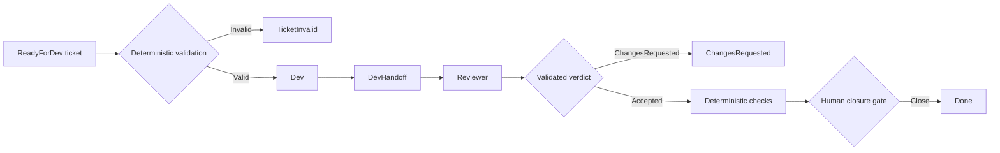
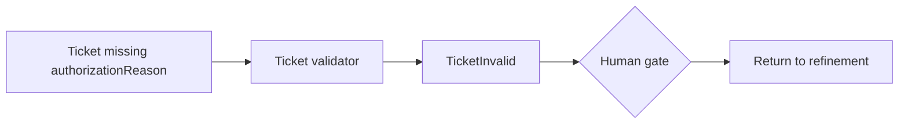
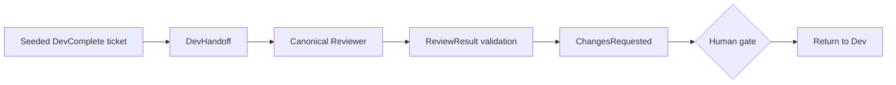
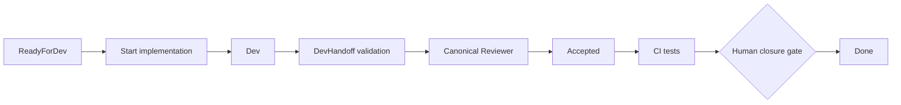

# AgentOps Conductor Demo

This repository is a small, repeatable demonstration of an AgentOps-style SDLC
orchestrated with Microsoft Conductor. It is intentionally narrow: each demo
isolates one control point in the delivery lifecycle rather than presenting a
complete production framework.

The central idea is simple: an LLM may generate and review code, while the
workflow owns state transitions, validation, routing, and human decision gates.

## Control model



The diagrams below show the route exercised by each scenario.

## Demo scenarios

### 1. Invalid ticket

`workflows/demo/01-ticket-invalid.yaml` runs a deterministic ticket check.
The ticket intentionally lacks `authorizationReason`, so the workflow routes to
`TicketInvalid` before it invokes Dev or Reviewer. This demonstrates that an
incomplete task does not spend agent time or model tokens.



### 2. Reviewer requests changes

`workflows/demo/02-changes-requested.yaml` starts from a seeded, canonical Dev
delivery. The ticket is in `DevComplete`, with a `WorkflowBranch` and a
`DevHandoff`. The implementation deliberately lacks validation for empty names.
The canonical Reviewer must record a valid `ChangesRequested` result with a
concrete finding.

This is a controlled fault injection. It proves routing and evidence capture;
it does not claim that a reviewer catches every possible defect.



### 3. Happy path

`workflows/canonical/implement-task-v0.yaml` runs the complete canonical path
for a ticket in `ReadyForDev`:

```text
ReadyForDev → InProgress → DevComplete → Accepted → human closure → Done
```

Dev follows the task's TDD requirements, creates a canonical `DevHandoff`, and
Reviewer produces a canonical `ReviewResult`. Deterministic validation scripts
and a final human gate control the path to `Done`.



## Running the demos

Run commands from the repository root. On Windows, set UTF-8 output first to
avoid console rendering issues with some Conductor output:

```powershell
[Console]::OutputEncoding = [System.Text.UTF8Encoding]::new()
$env:PYTHONUTF8 = "1"
```

### Scenario 1

```powershell
conductor run workflows/demo/01-ticket-invalid.yaml
```

Choose **Acknowledge and return to refinement** at the human gate.

### Scenario 2

```powershell
conductor run workflows/demo/02-changes-requested.yaml
```

This requires a working Copilot provider connection. Choose **Acknowledge and
return to Dev** after the reviewer has produced `ChangesRequested`.

### Scenario 3

```powershell
conductor run workflows/canonical/implement-task-v0.yaml `
  --input ticket_dir=".agentops/tickets/ready-for-dev/TASK-20261006-003-happy-path"
```

At the final gate, choose **Close task as Done**.

## Resetting the demo

Every execution can change ticket state and create runtime artifacts. Reset the
repository to its prepared state before a replay:

```powershell
.\scripts\reset-demo.ps1
```

The script restores the local `demo-ready` tag and removes known runtime output
folders. It preserves the seeded Reviewer scenario.

## Canonical behavior

The authoritative AgentOps roles, governance, contracts and workflow rules live
outside this repository in `C:\Users\david.gomez\.agentops`. The local
`workflows/canonical/` directory is a versioned execution snapshot with paths
adapted for this demo repository. Demo workflows add scenario routing only;
they do not redefine Dev or Reviewer behavior.
